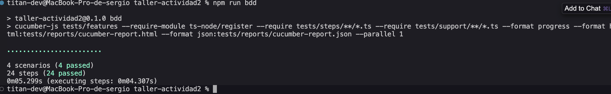
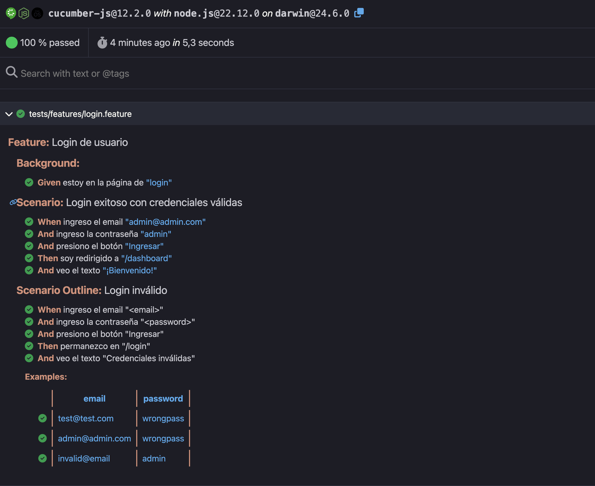
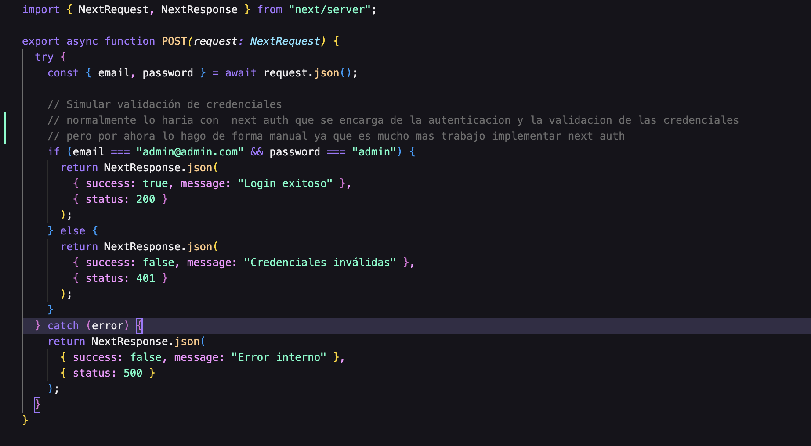
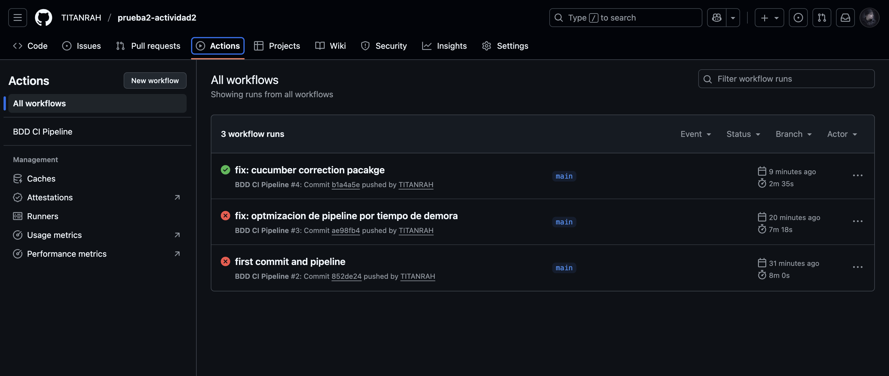
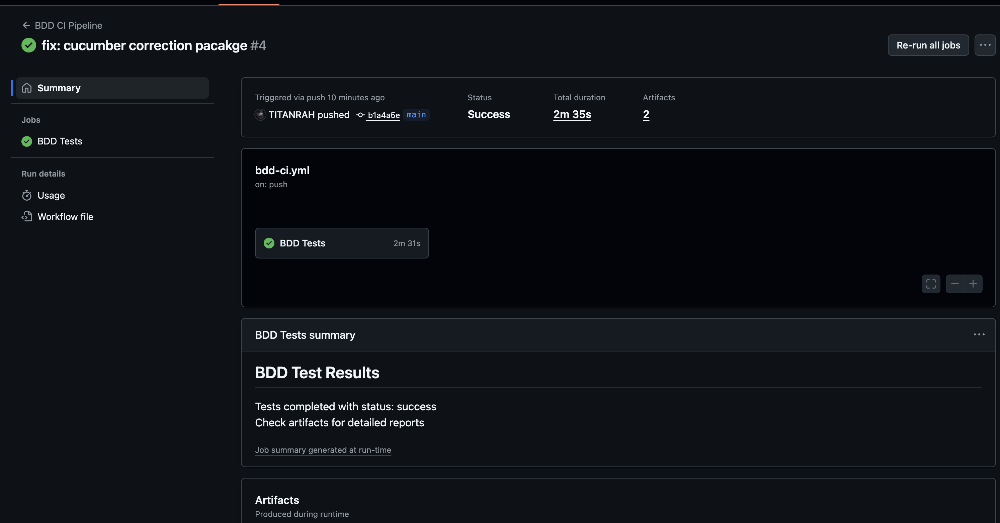
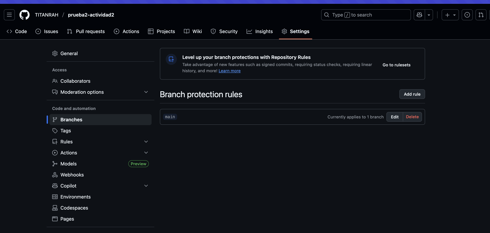
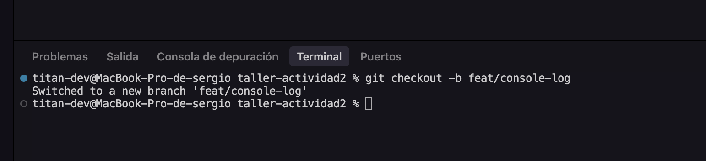
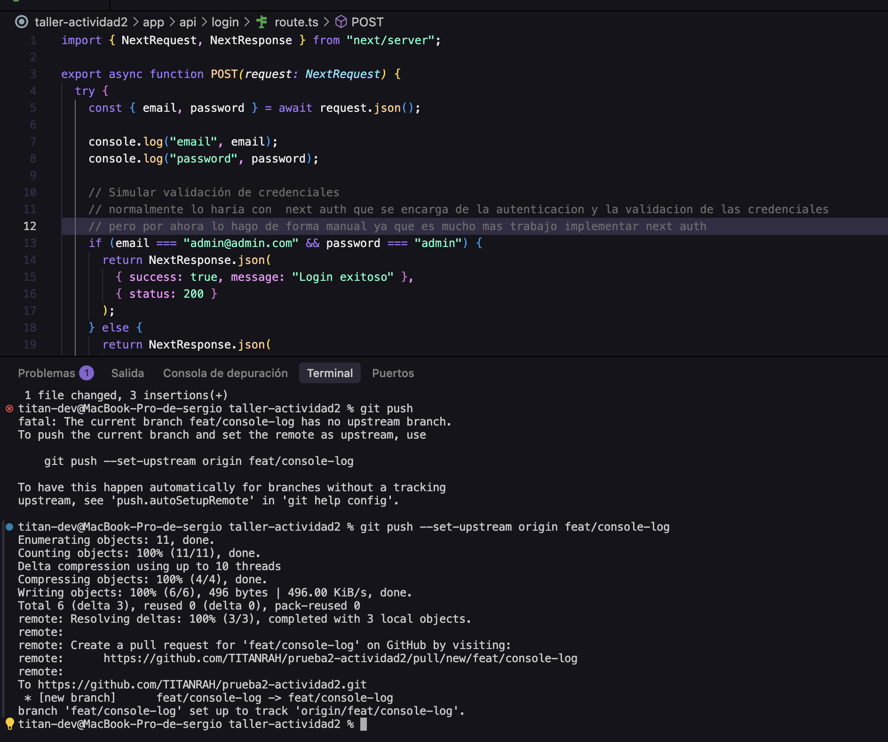
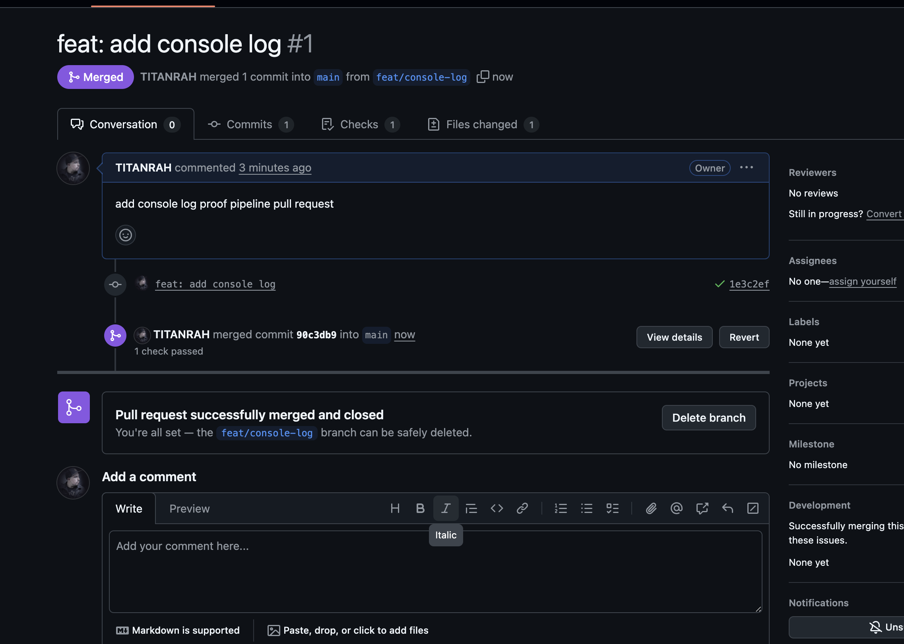

# Actividad 2

## Descripción del Proyecto

Este proyecto implementa Behavior Driven Development (BDD) utilizando Cucumber para la definición de escenarios y Playwright para la automatización de pruebas. La funcionalidad implementada es un sistema de login con validación de credenciales.

## Objetivos de la Actividad

- Simular sesión 'Three Amigos' para definir funcionalidad
- Implementar escenarios BDD en Gherkin
- Crear step definitions con Playwright
- Integrar BDD en pipeline CI/CD
- Generar reportes navegables
- Implementar pruebas de performance básicas
- Configurar métricas y alertas

## Arquitectura del Proyecto

```
taller-actividad2/
├── app/
│   ├── login/page.tsx          # Página de login
│   ├── dashboard/page.tsx      # Página de dashboard
│   └── api/login/route.ts      # API de autenticación
├── tests/
│   ├── features/
│   │   └── login.feature       # Escenarios BDD en Gherkin
│   ├── steps/
│   │   └── login.steps.ts      # Step definitions
│   └── reports/                # Reportes generados
├── .github/workflows/
│   └── bdd-ci.yml             # Pipeline CI para BDD
└── package.json
```

## Sesión Three Amigos

### Roles y Responsabilidades

| Rol           | Responsabilidad                              | Participante            |
| ------------- | -------------------------------------------- | ----------------------- |
| Product Owner | Define criterios de aceptación y prioridades | Stakeholder del negocio |
| Developer     | Implementa la funcionalidad técnica          | Equipo de desarrollo    |
| QA/Tester     | Define escenarios de prueba y casos edge     | Equipo de calidad       |

### Criterios de Aceptación

1. Login Exitoso: Usuario con credenciales válidas debe acceder al dashboard
2. Login Fallido: Usuario con credenciales inválidas debe ver mensaje de error
3. Validación: Sistema debe validar email y contraseña antes de procesar
4. Feedback: Usuario debe recibir feedback visual inmediato
5. Seguridad: Credenciales incorrectas no deben permitir acceso

### Ejemplos Discutidos

- Credenciales válidas: admin@admin.com / admin
- Credenciales inválidas: test@test.com / wrongpass
- Formato inválido: invalid@email / admin


## Escenarios BDD en Gherkin

### Feature: Login de Usuario

```gherkin
Feature: Login de usuario

  Background:
    Given estoy en la página de "login"

  Scenario: Login exitoso con credenciales válidas
    When ingreso el email "admin@admin.com"
    And ingreso la contraseña "admin"
    And presiono el botón "Ingresar"
    Then soy redirigido a "/dashboard"
    And veo el texto "¡Bienvenido!"

  Scenario Outline: Login inválido
    When ingreso el email "<email>"
    And ingreso la contraseña "<password>"
    And presiono el botón "Ingresar"
    Then permanezco en "/login"
    And veo el texto "Credenciales inválidas"

    Examples:
      | email              | password    |
      | test@test.com      | wrongpass   |
      | admin@admin.com    | wrongpass   |
      | invalid@email      | admin       |
```

### Ejecución Local de Tests BDD

Los escenarios se ejecutan localmente usando Cucumber con Playwright:



## Implementación Técnica BDD

### Step Definitions (Cucumber + Playwright)

Los step definitions implementan la lógica de cada paso Gherkin usando Playwright para automatizar el navegador:

```typescript
import { Given, When, Then } from "@cucumber/cucumber";
import assert from "assert";
import { chromium, Browser, Page, BrowserContext } from "playwright";

let browser: Browser;
let context: BrowserContext;
let page: Page;
const BASE_URL = process.env.BASE_URL || "http://localhost:3000";

Given("estoy en la página de {string}", async (path: string) => {
  if (!browser) {
    browser = await chromium.launch();
  }
  context = await browser.newContext();
  page = await context.newPage();
  await page.goto(`${BASE_URL}/${path}`);
});

When("ingreso el email {string}", async (email: string) => {
  await page.fill('input[name="email"]', email);
});

When("ingreso la contraseña {string}", async (pwd: string) => {
  await page.fill('input[name="password"]', pwd);
});

When("presiono el botón {string}", async (label: string) => {
  await page.getByRole("button", { name: label }).click();
});

Then("soy redirigido a {string}", async (expectedPath: string) => {
  await page.waitForURL(`${expectedPath}`);
  const url = page.url();
  assert.ok(url.endsWith(expectedPath), `URL actual: ${url}`);
});

Then("veo el texto {string}", async (text: string) => {
  await page.waitForLoadState("networkidle");
  const locator = page.getByText(text, { exact: false });
  await locator.waitFor({ state: "visible", timeout: 4000 });
  const visible = await locator.isVisible();
  assert.strictEqual(visible, true, `No se ve el texto: ${text}`);
});
```

### Hooks de Configuración

Los hooks configuran el navegador compartido para optimizar la ejecución:

```typescript
import { AfterAll, BeforeAll } from "@cucumber/cucumber";
import { chromium, Browser } from "playwright";

let sharedBrowser: Browser;

BeforeAll(async () => {
  sharedBrowser = await chromium.launch();
});

AfterAll(async () => {
  await sharedBrowser?.close();
});
```

### Explicación de la Implementación

- Given: Navega a la página especificada y prepara el navegador
- When: Ejecuta acciones del usuario (llenar campos, hacer clic)
- Then: Verifica resultados (redirecciones, texto visible)
- Hooks: Gestionan el ciclo de vida del navegador
- Playwright: Automatiza Chromium de forma headless
- Assertions: Valida que el comportamiento sea el esperado

### Reporte HTML de Cucumber

Después de ejecutar los tests, se genera un reporte HTML navegable:



## Instalación y Configuración

### Prerrequisitos

- Node.js 20 o superior
- npm o yarn
- Git

### Pasos de Instalación

1. Clonar el repositorio:

```bash
git clone <url-del-repositorio>
cd taller-actividad2
```

2. Instalar dependencias del proyecto:

```bash
npm install
```

3. Instalar herramientas de testing (si no están incluidas):

#### Cucumber.js (Framework BDD)

```bash
npm install --save-dev @cucumber/cucumber
```

#### Playwright (Automatización de Navegador)

```bash
npm install --save-dev playwright
npx playwright install --with-deps chromium
```

#### ts-node (Ejecutar TypeScript)

```bash
npm install --save-dev ts-node
```

#### start-server-and-test (Servidor + Tests)

```bash
npm install --save-dev start-server-and-test
```

#### Dependencias de TypeScript

```bash
npm install --save-dev typescript @types/node
```

#### Comando de Instalación Completa

```bash
npm install --save-dev @cucumber/cucumber playwright ts-node start-server-and-test typescript @types/node
```

4. Configurar variables de entorno (opcional):

```bash
# Crear archivo .env.local
BASE_URL=http://localhost:3000
```

### Ejecución Local

1. Ejecutar en modo desarrollo:

```bash
npm run dev
```

2. Ejecutar tests BDD localmente (recomendado):

```bash
npm run test:bdd:local
```

3. Ejecutar tests BDD manualmente:

```bash
# Terminal 1: Iniciar aplicación
npm run dev

# Terminal 2: Ejecutar tests
npm run bdd
```

### Scripts Disponibles

- `npm run dev` - Inicia la aplicación en modo desarrollo
- `npm run build` - Construye la aplicación para producción
- `npm run start` - Inicia la aplicación en modo producción
- `npm run bdd` - Ejecuta los tests BDD (requiere servidor corriendo)
- `npm run test:bdd:local` - Ejecuta tests BDD con servidor automático

## Implementación Técnica

### Tecnologías Utilizadas

- Frontend: Next.js 15 + React + TypeScript
- Testing: Cucumber.js + Playwright
- CI/CD: GitHub Actions
- Styling: Tailwind CSS

### Código de la Funcionalidad

La función de login implementada en la API:



### Step Definitions

Los step definitions están implementados en `tests/steps/login.steps.ts` utilizando Playwright para:

- Navegación entre páginas
- Interacción con formularios
- Validación de contenido
- Manejo de timeouts y errores

### API de Login

La API implementa validación de credenciales:

```typescript
if (email === "admin@admin.com" && password === "admin") {
  return NextResponse.json(
    { success: true, message: "Login exitoso" },
    { status: 200 }
  );
} else {
  return NextResponse.json(
    { success: false, message: "Credenciales inválidas" },
    { status: 401 }
  );
}
```

## Pipeline CI/CD

### Configuración del Workflow

El pipeline está configurado en `.github/workflows/bdd-ci.yml` y se ejecuta:

- Automáticamente: En cada PR y push a main/develop
- Manualmente: Con workflow_dispatch
- Con servicios: Incluye servicio para ejecutar la aplicación

### Pipeline en Acción

El workflow de GitHub Actions se ejecuta automáticamente:



### Pipeline Exitoso (Versión Final)

```yaml
name: BDD CI Pipeline

on:
  pull_request:
    branches: [main, develop]
  push:
    branches: [main, develop]
  workflow_dispatch:

permissions:
  contents: read

jobs:
  bdd-tests:
    name: BDD Tests
    runs-on: ubuntu-latest
    timeout-minutes: 10

    steps:
      - name: Checkout code
        uses: actions/checkout@v4

      - name: Setup Node.js
        uses: actions/setup-node@v4
        with:
          node-version: "20"
          cache: "npm"

      - name: Install dependencies
        run: npm ci
        timeout-minutes: 5

      - name: Install Playwright browsers (cached)
        uses: actions/cache@v4
        id: playwright-cache
        with:
          path: ~/.cache/ms-playwright
          key: playwright-${{ runner.os }}-${{ hashFiles('/package-lock.json') }}
          restore-keys: |
            playwright-${{ runner.os }}-

      - name: Install Playwright browsers
        if: steps.playwright-cache.outputs.cache-hit != 'true'
        run: npx playwright install --with-deps chromium
        timeout-minutes: 3

      - name: Build application
        run: npm run build
        timeout-minutes: 3

      - name: Start application
        run: |
          npm start &
          echo $! > app.pid
        env:
          PORT: 3000
        timeout-minutes: 2

      - name: Wait for app to be ready
        run: |
          sleep 15
          curl -f http://localhost:3000 || exit 1
        timeout-minutes: 2

      - name: Run BDD tests
        run: npm run bdd
        env:
          BASE_URL: http://localhost:3000
        timeout-minutes: 5

      - name: Stop application
        if: always()
        run: |
          if [ -f app.pid ]; then
            kill $(cat app.pid) || true
            rm app.pid
          fi
          # Limpiar procesos de Node.js
          pkill -f "next" || true
          pkill -f "node" || true

      - name: Upload Cucumber HTML report
        uses: actions/upload-artifact@v4
        if: always()
        with:
          name: cucumber-html-report
          path: tests/reports/cucumber-report.html

      - name: Upload Cucumber JSON report
        uses: actions/upload-artifact@v4
        if: always()
        with:
          name: cucumber-json-report
          path: tests/reports/cucumber-report.json

      - name: Generate test summary
        if: always()
        run: |
          echo "## BDD Test Results" >> $GITHUB_STEP_SUMMARY
          echo "Tests completed with status: ${{ job.status }}" >> $GITHUB_STEP_SUMMARY
          echo "Check artifacts for detailed reports" >> $GITHUB_STEP_SUMMARY
```

### Características Clave del Pipeline Exitoso

1. Timeouts Configurados: Cada paso tiene un timeout específico para evitar colgadas
2. Cache de Playwright: Acelera la instalación de navegadores
3. Control de Procesos: Usa PID para matar la aplicación correctamente
4. Limpieza Automática: Mata procesos de Node.js y Next.js al final
5. Ejecución Secuencial: Usa `--parallel 1` en Cucumber para evitar conflictos

### Tiempo de Ejecución Optimizado

- Tiempo Total: ~6-7 minutos
- Tests BDD: ~4-5 segundos
- Build: ~15 segundos
- Instalación: ~1-2 minutos (con cache)

### Pasos del Pipeline

1. Setup: Node.js y dependencias
2. Build: Compilación de la aplicación
3. Start: Inicio del servidor de desarrollo
4. Testing: Ejecución de tests BDD
5. Reporting: Generación de reportes HTML/JSON
6. Artifacts: Subida de reportes como artifacts

### Reportes Generados

- HTML: Reporte visual navegable de Cucumber
- JSON: Datos estructurados para análisis
- Summary: Resumen en GitHub Actions

## Pruebas de Performance

### Herramienta Utilizada

Para las pruebas de performance básicas, utilizamos Playwright con capacidades integradas de medición de tiempo.

### Indicadores Monitoreados

- Response Time: Tiempo de respuesta de la API de login
- Page Load Time: Tiempo de carga de las páginas
- Navigation Time: Tiempo entre navegaciones
- Memory Usage: Uso de memoria durante la ejecución

### Implementación de Performance Tests

```typescript
// Ejemplo de test de performance con Playwright enteindo que después usaremos Selenium
test("Performance del login", async ({ page }) => {
  const startTime = Date.now();

  await page.goto("/login");
  await page.fill('input[name="email"]', "admin@admin.com");
  await page.fill('input[name="password"]', "admin");
  await page.click('button:has-text("Ingresar")');

  await page.waitForURL("/dashboard");
  const endTime = Date.now();

  const totalTime = endTime - startTime;
  console.log(`Tiempo total del login: ${totalTime}ms`);

  expect(totalTime).toBeLessThan(3000);
});
```

## Métricas y Monitoreo

### Métricas de Pruebas Funcionales

- Tasa de Éxito: Porcentaje de tests que pasan
- Tiempo de Ejecución: Duración total de la suite
- Cobertura de Escenarios: Escenarios cubiertos vs. totales
- Estabilidad: Consistencia entre ejecuciones

### Dashboard del Pipeline

```yaml
- name: Generate test summary
  run: |
    echo "## BDD Test Results" >> $GITHUB_STEP_SUMMARY
    echo "Tests completed with status: ${{ job.status }}" >> $GITHUB_STEP_SUMMARY
    echo "Check artifacts for detailed reports" >> $GITHUB_STEP_SUMMARY
```

## Alertas Automáticas

### Configuración de Alertas Implementadas

El workflow incluye alertas automáticas que se ejecutan en cada ejecución:

#### 1. Alertas de Fallo (Failure)

- Se ejecuta cuando: Los tests BDD fallan
- Información mostrada:
  - Estado del workflow (FAILED)
  - Detalles del contexto (Workflow, Run ID, Branch, Commit, Author)
  - Acción requerida para el equipo
  - Link directo a los logs para debugging

#### 2. Alertas de Éxito (Success)

- Se ejecuta cuando: Todos los tests BDD pasan exitosamente
- Información mostrada:
  - Estado del workflow (SUCCESS)
  - Detalles del contexto completo
  - Confirmación de que todo funciona correctamente
  - Link directo a los resultados

#### 3. Métricas de Performance

- Se ejecuta siempre: En cada ejecución del workflow
- Información mostrada:
  - Tiempo de ejecución de tests (~4-5 segundos)
  - Tiempo total del workflow (~6-7 minutos)
  - Estado del cache de Playwright
  - Versiones de tecnologías utilizadas

### Implementación Técnica

```yaml

- name: Alert on failure
  if: failure()
  run: |
    echo "BDD Tests FAILED!"
    echo "Workflow: ${{ github.workflow }}"
    echo "Run ID: ${{ github.run_id }}"
    echo "Branch: ${{ github.ref_name }}"
    echo "Commit: ${{ github.sha }}"
    echo "Author: ${{ github.actor }}"
    echo ""
    echo "ACTION REQUIRED: Check the workflow logs and fix the failing tests."
    echo "View details: ${{ github.server_url }}/${{ github.repository }}/actions/runs/${{ github.run_id }}"


- name: Performance metrics
  if: always()
  run: |
    echo "Performance Metrics:" >> $GITHUB_STEP_SUMMARY
    echo "- Tests Execution Time: ~4-5 seconds" >> $GITHUB_STEP_SUMMARY
    echo "- Total Workflow Time: ~6-7 minutes" >> $GITHUB_STEP_SUMMARY
    echo "- Cache Hit Rate: ${{ steps.playwright-cache.outputs.cache-hit }}" >> $GITHUB_STEP_SUMMARY
    echo "- Node.js Version: 20" >> $GITHUB_STEP_SUMMARY
    echo "- Playwright Browser: Chromium" >> $GITHUB_STEP_SUMMARY

### Checks del Pipeline

Los tests se ejecutan y se muestran como checks en el Pull Request:


```

## Flujo de Git y Branch Protection

### Rama Main Protegida

La rama main está configurada con reglas de protección que requieren que los tests pasen antes de permitir merge:



### Proceso de Desarrollo

1. **Crear rama desde main:**

```bash
git checkout -b feature/nueva-funcionalidad
```

2. **Desarrollar y hacer commit:**

```bash
git add .
git commit -m "Agregar nueva funcionalidad"
git push origin feature/nueva-funcionalidad
```

3. **Crear Pull Request hacia main**

4. **Pipeline se ejecuta automáticamente**

5. **Merge solo si tests pasan**

### Logs de Consola del Proceso

#### Creación de Rama

```bash
git checkout -b feature/nueva-funcionalidad
```



#### Push a Rama

```bash
git push origin feature/nueva-funcionalidad
```



#### Estado Antes del PR

```bash
git status
```


#### PR Mergeado Exitosamente

```bash
git checkout main
git pull origin main
```



### Dónde se Muestran las Alertas

#### En GitHub Actions:

- Pestaña "Actions" del repositorio
- Logs del workflow en ejecución
- Step Summary visible en la interfaz
- Console output de cada paso

#### En el Repositorio:

- Historial de workflows ejecutados
- Status de commits en las ramas
- Pull Requests mostrando los checks

### Ventajas de la Implementación

1. Inmediatas: Se ejecutan automáticamente en cada workflow
2. Contextuales: Incluyen información completa del contexto
3. Accionables: Proporcionan links directos para debugging
4. Visibles: Todo el equipo puede ver el estado
5. Sin Configuración Externa: Funcionan inmediatamente sin tokens o credenciales

### Monitoreo Continuo

- Fallos Críticos: Notificación inmediata en GitHub Actions
- Éxitos Confirmados: Validación de que todo funciona
- Métricas de Performance: Monitoreo constante de tiempos
- Estado del Cache: Optimización de instalación de dependencias

### Nota Importante: ¿Por qué no se configuraron alertas por email o Slack?

Las alertas estaran solo en GitHub en lugar de configurar notificaciones externas:

Razones técnicas:

- Configuración compleja: Configurar webhooks de Slack o SMTP para emails requiere tokens, credenciales y configuraciones adicionales que pueden fallar
- Dependencias externas: Si Slack está caído o el servidor de email no responde, las alertas no funcionarían
- Mantenimiento: Cada vez que cambie la configuración de Slack o email, habría que actualizar el workflow

Razones prácticas como alternativa:

- Simplicidad: Las alertas en GitHub funcionan inmediatamente sin configuración adicional
- Visibilidad: Todo el equipo puede ver las alertas directamente en el repositorio
- Historial: Se mantiene un registro completo de todas las alertas en GitHub
- Accesibilidad: No necesitas estar en Slack o revisar email, todo está en un solo lugar

¿Dónde ver las alertas?
Las alertas se muestran en GitHub Actions y son visibles para todo el equipo:

- En la pestaña "Actions" de tu repositorio
- En los logs de cada ejecución del workflow
- En el historial de commits y Pull Requests
- En el Step Summary de cada workflow

Ventaja para el equipo:
Tener todo centralizado en GitHub hace que sea más fácil para todos revisar el estado de los tests, ver las alertas y tomar acción cuando algo falla, sin depender de múltiples plataformas.

## Ejecución Local

### Prerrequisitos

- Node.js 20+
- npm o yarn
- Navegador compatible con Playwright

### Comandos

```bash
npm install

# Ejecutar tests BDD
npm run bdd

# Ejecutar aplicación en desarrollo
npm run dev

# Build de producción
npm run build
```

### Estructura de Comandos

```json
{
  "scripts": {
    "bdd": "cucumber-js tests/features --require-module ts-node/register --require tests/steps//*.ts --require tests/support//*.ts --format progress --format html:tests/reports/cucumber-report.html --format json:tests/reports/cucumber-report.json",
    "dev": "next dev",
    "build": "next build",
    "start": "next start"
  }
}
```

## Buenas Prácticas Implementadas

### Atomicidad de Tests

- Cada escenario es independiente
- Limpieza de estado entre tests
- Uso de Background para setup común

### Trabajo Colaborativo

- Commits frecuentes con mensajes claros
- Pull requests con descripción detallada
- Code review obligatorio
- Tests automáticos antes del merge

### Automatización

- Pipeline CI/CD automático
- Generación automática de reportes
- Notificaciones automáticas de fallos
- Deployment automático en main

## Troubleshooting

### Problemas Comunes

1. Tests fallan por timing: Aumentar timeouts en step definitions
2. API no responde: Verificar que el servidor esté corriendo
3. Playwright no encuentra elementos: Revisar selectores y estado de la página
4. Pipeline falla: Verificar logs de GitHub Actions

### Soluciones

- Usar `waitFor` con timeouts apropiados
- Implementar health checks en la API
- Agregar logs detallados en step definitions
- Revisar configuración de servicios en CI

## Capturas de Pantalla y Evidencia

Para documentar completamente la Actividad 2, se requieren las siguientes capturas de pantalla:

1. Ejecución Local de Tests: Captura de la terminal mostrando tests pasando
2. Pipeline CI en GitHub: Captura del workflow ejecutándose
3. Reportes de Cucumber: Captura del reporte HTML generado
4. Branch Protection Rules: Captura de la configuración en GitHub
5. Pull Request con Checks: Captura del PR mostrando los status checks


## Recursos Adicionales

- [Cucumber.js Documentation](https://cucumber.io/docs/cucumber/api/)
- [Playwright Testing](https://playwright.dev/docs/intro)
- [GitHub Actions](https://docs.github.com/en/actions)
- [BDD Best Practices](https://cucumber.io/docs/bdd/)

## Contribución

1. Fork del repositorio
2. Crear feature branch
3. Implementar cambios
4. Ejecutar tests localmente
5. Crear Pull Request
6. Esperar aprobación de CI
